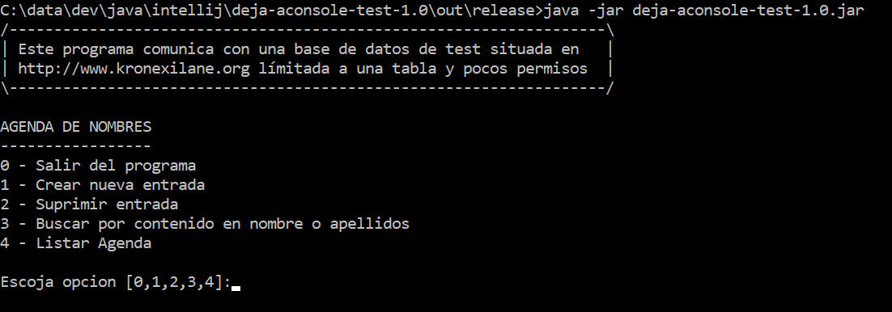

# DEJA-ACONSOLE
### Aplicación de Test

Este programa muestra las capacidades de dos de las
librerias mostradas, DEJA y AConsole

+ Muestra las capacidades de DEJA (La libreria ORM de mapeado objeto-relacional) contra
  una base de datos TEST de Agenda de nombres y teléfonos.
+ Muestra las capacidades de AConsole (Consola Avanzada) en concreto
  mostrando las utilidades de:
  + Input/Ouput (Entrada/Salida avanzada con verificación de tipos)
  + OptionList (Menús de Consola elegibles)
  + commandline (Gestión de línea de comandos)

El programa situado en **out/release** llamado deja-aconsole-test-1.0.jar esta
compilado ya con todo lo necesario, incluso con el driver jdbc por lo que puede ser
ejecutado directamente desde la línea de comandos:

Parámetros:

      -help: Visualiza un pequeño texto de ayuda.

Sin parámetros mostrará el menú de la AGENDA.
